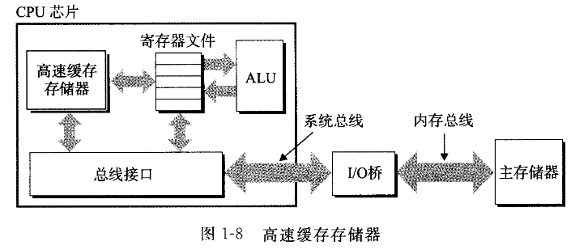

# 1 - 计算机系统漫游

&emsp;&emsp;计算机系统是由`硬件`和`系统软件`组成。一些程序员希望深入了解这些组件是如何工作的以及这些组件是如何影响程序的正确性和性能的，以此来提高自身的技能。

## 1.1 信息就是位+上下文

&emsp;&emsp;以下将从`hello.c`示例程序来介绍`C`。帮助了解系统上执行`hello`程序时，系统发生了什么以及为什么会这样。

```c
#include <stdio.h>

int main()
{
    printf("hello, world\n");
    return 0;
}
```

&emsp;&emsp;`hello.c`程序的生命周期是从一个*源程序*开始的，即程序员通过编辑器创建并保存文本文件，文件名为`hello.c`。源程序实际上就是一些`01`需序列，$8$个位组织为成一组，成为一个字节。每个字节表示程序中的某些文本字符

&emsp;&emsp;`hello.c`的表示方法说明：系统中的所有的信息，都是由一串比特表示的，唯一能区分不同的数据对象的方法就是读这些数据对象的上下文。

## 1.2 程序被其他程序翻译成不同的格式

&emsp;&emsp;`hello.c`程序的生命周期是从一个高级`C`语言程序开始的。为了运行这个程序，每条语句都必须被其他程序转化为一系列的低级`机器语言`指令。然后这些指令按照一种成为可执行目标程序的格式打包好，并以二进制磁盘文件的形式保存。

&emsp;&emsp;在`Unix`系统上，从源文件到目标文件的转化是由编译器驱动程序完成的：

```shell
linux> gcc -o hello hello.c
```

&emsp;&emsp;以上命令`GCC`编译器驱动程序读取源程序`hello.c`，并把它翻译成一个可执行目标文件`hello`。这个翻译如下图所示。执行四个步骤（预处理器、编译器、汇编器和链接器）一起构成编译系统。

<div align=center>

</div>

* **预处理阶段**。预处理（cpp）根据以字符`#`开头的命令，修改原始的`C`程序。`hello.c`在程序开头读取系统头文件`stdio.h`的内容，并把它直接插入程序文本中。结果得到另一个`C`程序，通常后缀为`.i`。
  
* **编译阶段**。编译器（ccl）将文本文件翻译成文本文件`hello.s`，它包含一个汇编语言程序。如下所示：

```c
main: 
    subq $8, %rsp
    movl $.LCO, %edi
    call puts
    movl $0, %eax
    addq $8, %rsp
    ret
```

&emsp;&emsp;以上代码描述了以一种文本格式描述了低级机器语言指令，汇编语言是非常有用的，因为它为不同高级语言的不同编译器提供了通用的输出语言。

* **汇编阶段**。汇编器（as）将`hello.s`翻译成机器语言指令，把这些指令打包成一种可重定向定位目标程序的格式，并将结果保存在目标文件`hello.o`中。它包含的$17$个字节是函数`main`的指令编码。

* **链接阶段**。`hello`程序调用了`printf`函数，它是每个`C`编译器都提供的标准`C`库中的一个函数。`printf`函数存在于一个名为`printf.o`的单独的预编译好了的目标文件中。链接器（ld）就负责处理这种合并。结果得到`hello`文件，它是一个可执行目标文件可以被加载到内存中，由系统执行。

## 1.3 了解编译系统如何工作是大有益处的

&emsp;&emsp;一些重要的原因促使程序员必须知道编译系统是如何工作的。

* **优化程序性能**。为了在`C`程序总做出好的编码选择，确实需要了解一些机器代码以及编译器将不同的`C`语言转化为机器代码的方式。

* **理解链接时出现的错误**。一些最令人困扰的程序错误往往都与连接器操作有关。

* **避免安全漏洞**。缓冲区溢出错误是造成安全漏洞的主要原因。存在这些错误是因为很少有程序员能够理解需要限制从不受信任的源接收数据的数量和格式。

## 1.4 处理器读并解释储存在内存中的指令

&emsp;&emsp;源程序已经被翻译成了可执行目标文件`hello`，并被存在磁盘上。要想在`Unix`系统上运行该可执行文件，我们将它的文件名输入到称为`shell`的应用程序中：

```assembly
linux> ./hello
hello, world
```

&emsp;&emsp;`shell`是一个命令行解释器，它输出一个提示符，等待输入一个命令行，然后执行这个命令。如果首个单词不是内置`shell`命令，那么`shell`就会假设这是一个可执行文件的名字，它将加载并运行这个文件。

### 1.4.1 系统的硬件组成

&emsp;&emsp;为了理解运行`hello`程序时发生了什么，我们需要了解一个典型系统的硬件组织，下图时近期`Intel`系统产品族的模型。以下分阶段对其进行详尽介绍。

<div align=center>

</div>


1. **总线**

&emsp;&emsp;一组电子管道，称作总线，它携带信息字节并负责在各部件间传递。通常总线被设计成传送定长的字节块，即*字（word）*。字中的字节数时一个基本的系统参数，各个系统中都不尽相同。大多机器字长要么是$4$个字节（$32$位），要么是$8$个字节（64位）。

2. **I/O设备**

&emsp;&emsp;`I/O`设备是系统与外部世界的联系通道。示例系统包括四个`I/O`设备：作为用户输入的键盘和鼠标，作为用户输出的显示器，以及用于长期存储数据和程序的磁盘驱动器。

&emsp;&emsp;每个`I/O`设备都通过一个控制器或适配器与`I/O`总线相连。控制器是`I/O`设备本身或者系统的主印制电路板上的芯片组。而适配器则是一块插在主板插槽上的卡。

3. **主存**

&emsp;&emsp;主存是一个临时存储设备，在处理执行程序时，用来存放程序和程序处理的数据。主存是由一组动态随机存取器芯片组成的。存储器是一个线性的字节数组，每个字节都有其唯一的地址。一般来说，组成程序的每条机器指令都由不同数量的字节构成。

4. **处理器**

&emsp;&emsp;中央处理单元（CPU），是解释或执行存储在主存中指令的引擎。处理器的核心是一个大小位一个字的存储设备或寄存器，称为程序计算器（PC）。在任何时刻，PC都指向主存中某条机器语言指令（指令所在的地址）。

&emsp;&emsp;从系统通电开始，直到系统断电，处理器一直不断地执行程序计数器指向的指令，再更新程序计数器，使其指向下一条指令。处理器看上去是按照一个非常简单的指令执行模型来操作的，这个模型是由指令集架构决定的。处理器从PC指向的内存中读取指令，解释指令中的位，执行该指令之时的简单操作，然后更新PC，使其指向下一条指令。

&emsp;&emsp;寄存器文件时一个小的存储设备，由一些单个字长的寄存器组成，每个寄存器都由唯一的名字。ALU计算新的数据和地址。

&emsp;&emsp;处理器看上去是它的指令集架构的简单是实现，但是实际上现代处理器使用了非常复杂的机制来加速程序的执行。因此，处理器的指令集架构和处理器的微体系结构需要区分开来，前者描述的是每条机器代码指令的效果，后者描述的是处理器实际上是如何实现的。

### 1.4.2 运行hello程序

&emsp;&emsp;以下介绍程序的运行流程

&emsp;&emsp;初始时，`shell`程序执行它的指令，等待我们输入一个指令。当在键盘输出"./hello"后，字符串将会逐一读入寄存器，并放到内存中。

<div align=center>

</div>

&emsp;&emsp;当敲击回车时，结束输入。指令将代码和数据从磁盘复制到主存（直接存储器存取，DMA）。数据包括要输出的字符串`hello, world\n`。

<div align=center>

</div>

&emsp;&emsp;一旦目标文件`hello`中的代码和数据被加载到主存中，处理器开始执行及机器语言指令。将要输出的字符串字节从主存复制到寄存器文件，再从寄存器文件中复制到显示设备，最终显示到屏幕上。

<div align=center>

</div>

## 1.5 高速缓存至关重要

&emsp;&emsp;从上揭示一个重要的问题，就是系统花费大量时间把信息从一个地方挪到另一个地方。因此，系统设计者主要目标就是让以上复制操作尽可能地完成。

&emsp;&emsp;一个典型的寄存器文件只存储几百个字节的信息，主存里可存放几十亿字节。然而，处理器从寄存器文件中读取数据要比主存快100多倍。针对这种差异，计算机中设计了*高速缓存存储器*，作为暂时的集结区域，存放可能的信息。

<div align=center>

</div>

&emsp;&emsp;其中，`L1`高速缓存位于处理器芯片上，缓存容量可以达到数万字节，访问速度几乎和访问寄存器文件一样;`L2`高速缓存通过一条特殊的的总线连接到处理器。进程访问`L2`高速缓存的时间比`L1`时间长5倍。两者是一种叫做静态随机访问存储器(SRAM)的硬件技术实现的。系统可以获得一个很大的存储器，并且访问速度很快，原因是利用了高速缓存的*局部性*原理。

## 1.6 存储设备形成层次结构

&emsp;&emsp;每个计算机系统中的存储设备都被组织成一个存储器层次结构。在这个层次中，从上到下，设备的访问速度越来越慢、容量越来越大，造价越来越低。

<div align=center>

</div>

&emsp;&emsp;层次结构的主要思想就是上一层的存储器作为低一层存储器的高速缓存。

## 1.7 操作系统管理硬件

&emsp;&emsp;当`shell`加载和运行`hello`程序时，两者都没有直接访问键盘、显示器、磁盘或者主存。取而代之的是依靠操作系统提供的服务。所有应用程序对硬件的操作尝试都必须通过操作系统。

<div align=center>

</div>

&emsp;&emsp;操作系统有两个基本功能：（1）防止硬件被失控的应用程序滥用；（2）向应用程序提供简单一致的机制来控制复杂而又通常大不相同的低级硬件设备。操作系统通过几个基本的抽象概念（进程、虚拟内存和文件）来实现这两个功能。

<div align=center>

</div>

### 1.7.1 进程

&emsp;&emsp;在系统上运行时，操作系统会提供一种假象，就好像只有这有这个程序在运行。程序看上去独占处理器、主存和`I/O`设备，即看上去程序是系统内存中唯一的对象。这些假象是通过进程的概念来实现的，进程是计算机科学中最重要的概念之一。

&emsp;&emsp;*进程*是操作系统对一个正在运行的程序的抽象。一个系统上可以运行多个进程，而每个进程都好像在独占地使用硬件。而*并发运行*，则是说一个进程的指令和另一个进程的指令是交错执行的。传统系统在一个时刻只能执行一个程序，而先进的*多核*处理器同时能够执行多个程序。处理器通过在进程间切换来实现并发执行多个进程。操作系统实现这种交错执行的机制称为*上下文切换*。

&emsp;&emsp;操作系统保持跟踪进程运行所需的所有状态信息。这种状态就是*上下文*，包括了例如*PC*和*寄存器文件的当前值*，以及*主存的内容*。当要从某个进程切换到一个某个新进程时，就会进行*上下文切换*，即保存当前进程的*上下文*、*恢复新进程的上下文*，然后传递到新进程。从上次停止的地方开始运行。

<div align=center>

</div>

&emsp;&emsp;上图两个并发的进程：`shell`进程和`hello`进程。一开始，只有`shell`进程在运行。当我们运行`hello`程序时，`shell`通过调用一个专门的函数，即系统调用，来执行请求，系统调用会将控制权传递给操作系统。操作系统保存`shell`进程的上下文，创建一个新的`hello`进程及其上下文，然后将控制权传给新的`hello`进程。`hello`进程结束后，恢复`shell`进程的上下文，等待其他命令行的输入。

&emsp;&emsp;从一个进程到另一个进程的转化是由操作系统的*内核（kernel）*管理的。内核是操作系统代码常驻主存的部分。当应用程序需要操作系统的某些操作时，它就执行一条特殊的*系统调用（system call）*指令，将控制权传递给内核。然后内核执行被请求的操作并返回应用程序。内核不是一个独立的进程，相反，它时系统管理全部进程所用代码和数据结构的集合。

### 1.7.2 线程

&emsp;&emsp;一个进程实际上可以由多个称为*线程*的执行单元组成，每个线程都运行在进程的上下文中，共享同样的代码和全局数据。由于网络服务器中对并行处理的需求，线程称为越来越重要的编程模型，因为多线程之间比多进程之间更容易共享数据，线程一般来说也比进程更高效。

### 1.7.3 虚拟内存

&emsp;&emsp;*虚拟内存*是一个抽象概念，它为每个进程提供一个假象，即每个进程都在独占地使用主存。每个进程看到的内存都是一致的，称为*虚拟地址空间*。在`Linux`中，地址空间最上面的区域是保留给操作系统的代码和数据的，对所有的进程都是一样的。地址空间的底部区域存放用户进程定义的代码和数据。

<div align=center>

</div>

&emsp;&emsp;每个进程看到的虚拟地址空间由大量准确定义的区构成，每个区有专门的功能。

* *程序代码和数据*：对所有的进程来说，代码是从同一固定地址开始，紧接着是全局变量相对应的数据地址。代码和数据区是直接按照可执行文件的内容初始化的。
* *堆*：代码和数据区在进程一开始运行时就被制定了大小，与此不同，当调用像`malloc`和`free`这样的函数时，堆可以在运行时动态地扩展和收缩。
* *共享库*：大约在地址空间的中间部分是一块用来存放像C标准库和数学库这样的共享的代码和数据的区域。
* *栈*：位于用户虚拟地址空间顶部的是用户栈，用于实现函数调用。和堆一样，用户栈在程序执行期间可以动态的扩展和收缩。
* *内核虚拟内存*：地址空间顶部的区域是为内核保留的。不允许应用程序读写这个区域的内容。相反，它们必须调用内核来执行这些操作。

### 1.7.4 文件

&emsp;&emsp;文件就是字节序列。每个`I/O`设备，包括磁盘、键盘、显示器，甚至网络，都可以看成文件。系统中的所有的输入输出都是通过使用一小组称为`Unix I/O`的系统函数调用读写文件来实现的。

&emsp;&emsp;文件这个简单而精致的概念是非常强大的，因为向应用程序提供了一个统一的视图，来看待系统中可能含有的所有各样的`I/O`设备。

## 1.8 系统之间利用网络通信

&emsp;&emsp;实际上，现代系统经常通过网络和其他系统连接到一起。从单独的系统来看，网络可以视为一个`I/O`设备。系统从主存复制一串字节到网络适配器，数据流经过网络到达另一台机器。相似，系统可以读取从其他机器发来的数据，并复制到自己的主存。

<div align=center>

</div>
&emsp;&emsp;可以使用`telnet`应用在远程主机上运行`hello`程序。在云端运行`hello`程序包含以下几个步骤。

<div align=center>

</div>

&emsp;&emsp;在客户端键入`hello`字符串并敲回车后，客户端软件就会把字符串发给服务器，服务器接收到字符串后，就会传给远程的`shell`程序。远端`shell`运行`hello`程序，并将输入行返回给服务器。最后，转发给客户端，客户端将输出内容输出到本地终端中。

## 1.9 重要主题

### 1.9.1 Amdahl定律

&emsp;&emsp;`Amdahl`定律主要的思想是，当对系统的某个部分加速时，对其系统的整体性能的影响取决于该部分的重要性和加速程度。若某个应用程序需要时间为 $T_{old}$。假设系统某部分所需执行时间与该事件的比例为 $\alpha$,而该部分性能提升比例为 $k$。因此，总的执行时间应为下式子：
$$
T_{new} = (1 - \alpha)T_{old} + \alpha T_{old}/k=T_{old}[(1-\alpha) + \alpha/k]
$$
&emsp;&emsp;因此，加速比如下式：
$$
S = \frac{T_{old}}{T_{new}}=\frac{1}{(1-\alpha)+\alpha/k}
$$

### 1.9.2 并发和并行

&emsp;&emsp;*并发（concurrency）*是一个通用的概念，指一个同时具有多个活动的系统；而*并行（parallelism）*指的是用并发来使一个系统运行得更快。并行可以在计算机系统的多个抽象层次上运行。因此，按照由高到低的顺序强调三个层次。

#### 1. 线程级并发

&emsp;&emsp;设计同时有多个程序执行的系统，这就导致了并发。使用线程的方式，可以在一个进程中执行多个控制流。即可以实现一个窗口中开启Web浏览器，在另一个窗口中运行字处理器，同时又播放音乐。即使处理器必须在多个任务间切换，大多数实际上的计算也是由同一个处理器完成的。这种配置称为*单处理器系统*。

&emsp;&emsp;当构建一个由单操作系统内核控制的多处理器组成的系统时，得到了一个多处理器系统。随着多核处理器和超线程的出现，这种系统变的常见。

<div align=center>

</div>

&emsp;&emsp;多核处理器是把多个CPU（称为“核”）集成到一个集成电路芯片上。其中每个核都有自己的`L1`和`L2`高速缓存，`L1`高速缓存存放两个部分————一个保存最近取到的指令，另一个存放数据。这些核共享更高层次的高速缓存。

<div align=center>

</div>

&emsp;&emsp;*超线程*，或称为*同时多线程（simultaneous multi-threading）*，允许一个CPU执行多个控制流的技术。常规的处理器需要大约20000个时钟周期做不同线程间的转换，而超线程的处理器可以在单周期的基础上决定要执行哪一个线程。举例来说,`Intel Core i7`处理器可以让每个核执行两个线程，所以一个`4`核实际上可以并行地执行`8`个线程。

&emsp;&emsp;多处理器的使用可以从两个方面提高系统性能。减少了在执行多个任务时模拟并发的需要。其次，可以使应用程序运行得更快。

#### 2. 指令级并行

&emsp;&emsp;在较低的抽象层次上，现代处理器可以同时执行多条指令的属性称为*指令级并行*。可以通过*流水线（pipelining）*的使用，在流水线中，将执行一条指令所需要的活动划分成不同的步骤，将处理器的硬件组织成一系列的阶段，每个阶段执行一个步骤。这些步骤可以并行地操作。

#### 3. 单指令、多数据并行

&emsp;&emsp;在最低层次上，许多现代处理器拥有特殊的硬件，允许一条设备产生多个可以并行执行的操作，这种方式称为*单指令、多数据*，即`SIMD`并行。例如并行地对8对单精度浮点数做加法指令。

### 1.9.3 计算机系统中抽象的重要性

&emsp;&emsp;*抽象*是使用是计算机科学中最为重要的概念之一。为一组函数规定一个简单的应用程序接口就是一个很好的习惯。

&emsp;&emsp;在处理器里，*指令集架构*提供了对实际处理器硬件的抽象。底层的硬件远比抽象描述的要复杂，它并行地执行多条指令，但又总是与简单有序的模型保持一致。只要执行模型一样，不同的处理器实现也能执行相同的机器代码，而又提供不同的开销和性能。

<div align=center>

</div>
&emsp;&emsp;*虚拟机*提供对整个计算机的抽象，包括*操作系统、处理器和程序*。

## 1.10 小结

&emsp;&emsp;计算机系统是由硬件和系统软件组成的,它们共同协作以运行应用程序。计算机内部的信息被表示为一组组的位,它们依据上下文有不同的解释方式。程序被其他程序翻译成不同的形式,开始时是ASCII文本,然后被编译器和链接器翻译成二进制可执行文件。

&emsp;&emsp;处理器读取并解释存放在主存里的二进制指令。因为计算机花费了大量的时间在内存、 `I/O`设备和CPU寄存器之间复制数据,所以将系统中的存储设备划分成层次结构一CPU寄存器在顶部,接着是多层的硬件高速缓存存储器、 DRAM主存和磁盘存储器。在层次模型中,位于更高层的存储设备比低层的存储设备要更快,单位比特造价也更高。层次结构中较高层次的存储设备可以作为较低层次设备的高速缓存。通过理解和运用这种存储层次结构的知识,程序员可以优化C程序的性能。

&emsp;&emsp;操作系统内核是应用程序和硬件之间的媒介。它提供三个基本的抽象: 1)文件是对`I/O`设备的抽象;2)虚拟内存是对主存和磁盘的抽象; 3)进程是处理器、主存和`I/O`设备的抽象。

&emsp;&emsp;最后,网络提供了计算机系统之间通信的手段。从特殊系统的角度来看,网络就是一种`I/O`设备。