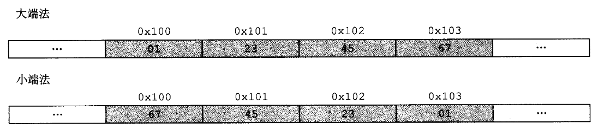
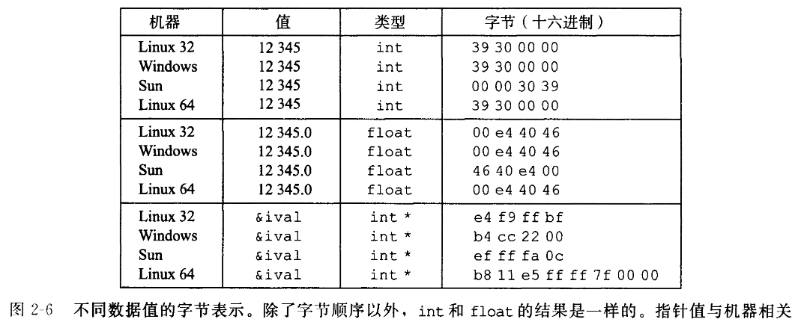
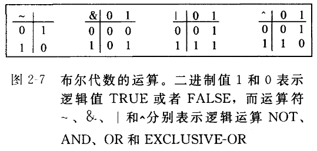

# 2 - 信息的表示和处理

## 2.1 信息存储

&emsp;&emsp;计算机使用*字节（byte）*作为最小的可寻址的内存单位，机器级程序将内存视为一个非常大的字节数组，称为*虚拟内存（virtual memory）*。内存的每个字节都由一个唯一的数字来标识，称为*地址（address）*，所有可能地址的集合就称为*虚拟地址空间（virtual address space）*。

### 2.1.1 十六进制表示法

&emsp;&emsp;一个字节由8位组成。在二进制表示法中，值域是$00000000_{2}$~$11111111_2$。由于二进制表示法太冗长，而十进制表示法与位模式的相互转化很麻烦。因此通常使用十六进制来书写位。

### 2.1.2 字数据大小

&emsp;&emsp;每台计算机都有一个*字长（word size）*，指明指针数据的标称大小。因为虚拟内存是以这样的一个字来编码的，所以字长决定的最重要的系统参数就是虚拟地址空间的最大大小。对于一个字长为$w$位的机器而言，虚拟地址的范围为$2^w-1$，程序最多访问$2^w$个字节。

&emsp;&emsp;对于32位字长限制虚拟地址空间为4千兆字节(写作$4GB$)，扩展到64位字长使得虚拟地址空间为$16EB$。大多数64位机器也能运行32位机器编译的程序，这是向后兼容。因此“32位程序”或“64位程序”，区别在于该程序是如何编译的，而不是其运行的机器类型。

### 2.1.3 寻址和字节顺序

&emsp;&emsp;几乎所有的机器上，多字节对象都被存储为连续的字节序列，对象的地址为所使用字节中最小的地址。某些机器选择在内存中按照从最低有效字节到最高有效字节的顺序存储对象，而另一些机器则按照从最高有效字节到最低有效字节顺序存储。前一种规则最低有效位在最前面，称为*小端法（little endian）*；后一种规则最高有效位在最前面，称为*大端法（big endian）*。假设变量x的类型为int，位于地址`0x100`处，它的十六进制值为`0x01234567`。

<div align="center">

</div>

&emsp;&emsp;通过以下代码能得到各个数据类型的字节表示：

```c
#include <stdio.h>

typedef unsigned char *byte_pointer;

void show_bytes(byte_pointer start, size_t len)
{
    size_t i;
    for (i = 0; i < len; i ++)
        printf(" %.2x", start[i]);
    printf("\n");
}

void show_int(int x)
{
    show_bytes((byte_pointer) &x, sizeof (int));
}

void show_float(float x)
{
    show_bytes((byte_pointer) &x, sizeof (float));
}

void show_pointer(void *x)
{
    show_bytes((byte_pointer) &x, sizeof(void *));
}
```

&emsp;&emsp;使用不同的机器运行的结果也会有所不同。

<div align="center">

</div>

&emsp;&emsp;可以看出除了`Sun`之外都是小端机器，`Sun`为大端机器。但是int与float的值都是一样的，另一方面，指针值完全不同，不同的机器/操作系统配置使用不同的存储分配规则。

### 2.1.4 表示字符串

&emsp;&emsp;每个字符都由标准编码来表示，最常见的是ASCII字符码。使用ASCII码作为字符码的任何系统上都将得到相同的结果，与字节顺序和字大小规则无关。因此，文本数据比二进制数据具有更强的平台独立性。

### 2.1.5 表示代码

&emsp;&emsp;不同的机器类型使用不同的且不兼容的指令和编码方式。即使是完全一样的进程，运行在不同的操作系统也会有不同的编码规则，因此二进制代码是不兼容的。

### 2.1.6 布尔代数简介

&emsp;&emsp;最简单的布尔代数式在二元集合`{0,1}`基础上定义的。以下定义了这种布尔代数的几种运算。

<div align="center">

</div>

### 2.1.7 C语言中的位级运算

&emsp;&emsp;C语言中`|`就是`OR`，`&`就是`AND`，`~`就是`NOT`，`^`就是`XOR`。

&emsp;&emsp;位级运算的一个常见用法就是实现*掩码*运算，表示从一个字中选出的位的集合。

### 2.1.8 C语言中的逻辑运算

&emsp;&emsp;C语言还提供了一组逻辑运算符`||`、`&&`和`!`，对应命题逻辑中的`OR`、`AND`和`NOT`运算。

### 2.1.9 C语言中的位移运算

&emsp;&emsp;C语言还提供了一组位移运算，向左或者向右移动位的模式，分别用符号`<<`和`>>`来计算。

> 注：当移动的k位，这里的k很大
>
> 当移动一个$w$位的值时，移位指令只考虑位移量的低$log_2{w}$位，因此实际上通过计算$k\ mod\ w$得到偏移量。

## 2.2 整数表示

### 2.2.1 整型数据类型

